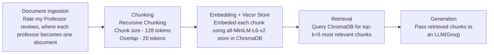

# Project 1 Planning: The Unofficial Guide

> Write this document before you write any pipeline code.
> Your spec and architecture diagram are what you'll use to direct AI tools (Claude, Copilot, etc.) to generate your implementation — the more specific they are, the more useful the generated code will be.
> Update the Retrieval Approach and Chunking Strategy sections if you change your approach during implementation.
> Update this file before starting any stretch features.

---

## Domain

<!-- What domain did you choose? Why is this knowledge valuable and hard to find through official channels? -->

The domain I chose was Rate my Professor. This knowledge is valuable because these are real reviews that students who have taken the class have submitted. 

---

## Documents

<!-- List your specific sources: URLs, subreddit names, forum threads, or file descriptions.
     Aim for at least 10 sources that together cover different subtopics or perspectives within your domain. -->

| # | Source | Description | URL or location |
|---|--------|-------------|-----------------|
| 1 |Rate my Professor | Lina Kloub RMP and her ratings | https://www.ratemyprofessors.com/professor/2754387|
| 2 |Rate my Professor | Olga Glebova RMP and her ratings | https://www.ratemyprofessors.com/professor/2963544|
| 3 |Rate my Professor | Swamy Narayan Jignaas Pattipati RMP and his ratings | https://www.ratemyprofessors.com/professor/3044671|
| 4 |Rate my Professor | Justin Furuness RMP and his ratings| https://www.ratemyprofessors.com/professor/3127655|
| 5 |Rate my Professor | David Strimple RMP and his ratings| https://www.ratemyprofessors.com/professor/2872422|
| 6 |Rate my Professor | Derek Aguiar RMP and his ratings| https://www.ratemyprofessors.com/professor/2460362|
| 7 |Rate my Professor | Laurent Michel RMP and ratings| https://www.ratemyprofessors.com/professor/1135923|
| 8 |Rate my Professor | Zhijie 'Jerry Shi RMP and ratings| https://www.ratemyprofessors.com/professor/1282131|
| 9 |Rate my Professor | Yufeng WU RMP and ratings| https://www.ratemyprofessors.com/professor/1756272|
| 10 |Rate my Professor| Jonathan Clark RMP and ratings| https://www.ratemyprofessors.com/professor/2898389|

---

## Chunking Strategy

<!-- How will you split documents into chunks?
     State your chunk size (in tokens or characters), overlap size, and explain why those
     numbers fit the structure of your documents.
     A review-heavy corpus warrants different chunking than a long FAQ. -->
**Chunk size:**

250 tokens

**Overlap:**

25 tokens

**Reasoning:**

Each review is short (~60-80 tokens) and self-contained, so I size chunks at 128 tokens to keep roughly one review per chunk. This gives each embedding a single, focused opinion instead of a blurry vector averaging 3 reviews on different topics — which retrieves more precisely for my professor-specific test questions. Because reviews are independent, overlap can stay small (20 tokens) just to avoid splitting a sentence across a boundary. A recursive chunking strategy fits best: it splits on review boundaries (blank lines) first, then sentences, then words, so chunks rarely break mid-thought. Token counts are measured with the same all-MiniLM-L6-v2 tokenizer used for embedding, so "128 tokens" matches what the model sees. Final chunk count: ~100 chunks across the 10 professor documents.

---

## Retrieval Approach

<!-- Which embedding model are you using (e.g., all-MiniLM-L6-v2 via sentence-transformers)?
     How many chunks will you retrieve per query (top-k)?
     If you were deploying this for real users and cost wasn't a constraint, what tradeoffs
     would you weigh in choosing a different embedding model — context length, multilingual
     support, accuracy on domain-specific text, latency? -->

**Embedding model:**

all-MiniLM-L6-v2

**Top-k:**

3-5 should work fine for this project, will most likely end up using 5.

**Production tradeoff reflection:**

If cost were not a constraint, I would most likely use a larger hosted embedding model such as OpenAi's embedding model. This is due to the fact that larger models will usually provide more accurate responses when asked complex questions.

When choosing a production model, I would weigh things like accuracy, context length limits, multilingual support, and latency. While a larger model might perform better and support more languages it can cause more latency as well. This is why all-MiniLM-L6-v2 which runs locally on the computer, provides fast response times, is simplier and provides low latency compared to larger hosted models.

---

## Evaluation Plan

<!-- List your 5 test questions with their expected correct answers.
     Questions should be specific enough that you can judge whether the system's response
     is right or wrong. "What are good dining halls?" is too vague.
     "What do students say about wait times at [dining hall name] during lunch?" is testable. -->

| # | Question | Expected answer |
|---|----------|-----------------|
| 1 | Is Swamy a good lecturer and does he make class engaging?| Yes, he is a great lecturer who makes class engaging and challenging for students.|
| 2 | Does Lina Kloub prepare students for exams and are they difficult?| Lina Kloub's exams tend to be a little difficult but most of the work on the exams are similar to those on her homework assignments and lectures.|
| 3 | Does Olga Glbova give a lot of homework throughout the week?| Yes, She assigns Zybooks every couple days and these can take a long time to complete.|
| 4 | Does Justin Furuness have lots of office hours for help when needed?| Yes, He is very acessible outside of class and tries to help  of his students to the best of his abilities.|
| 5 | Is David Strimple a tough grader?| Yes, He is an extremely tough grader that assigns lots of homework.|

---

## Anticipated Challenges

<!-- What could go wrong? Name at least two specific risks with reasoning.
     Consider: noisy or inconsistent documents, missing source attribution, off-topic
     retrieval, chunks that split key information across boundaries. -->

1. Conflicting reviews could make the output change. If 5 people say it was great but 4 said it was horrible there needs to be some type of middle ground answer.

2. If any of the reviews contain slang or different vocabulary used then the ones used in the question prompt, this could cause an unexpected output or confusion.

---

## Architecture

<!-- Draw a diagram of your pipeline showing the five stages:
     Document Ingestion → Chunking → Embedding + Vector Store → Retrieval → Generation
     Label each stage with the tool or library you're using.
     You can use ASCII art, a Mermaid diagram, or embed a sketch as an image.
     You'll use this diagram as context when prompting AI tools to implement each stage. -->

---

## AI Tool Plan

<!-- For each part of the pipeline below, describe:
     - Which AI tool you plan to use (Claude, Copilot, ChatGPT, etc.)
     - What you'll give it as input (which sections of this planning.md, which requirements)
     - What you expect it to produce
     - How you'll verify the output matches your spec

     "I'll use AI to help me code" is not a plan.
     "I'll give Claude my Chunking Strategy section and ask it to implement chunk_text()
     with my specified chunk size and overlap" is a plan. -->

**Milestone 3 — Ingestion and chunking:**

Claude:  

I want to implement a recursive chunking strategy to chunk the reviews for each professor. Each professor has their own text file in the documents folder that contains their id, name, link, and their 10 reviews. Using my pipeline diagram on lines 117-124 of planning.md, create a script that loads my documents, cleans them, and produces chunks matching the plan. Code this in Ingestion.py.

**Milestone 4 — Embedding and retrieval:**

Claude: 

Using the pipeline outline in planning.md I want you to generate my embedding and retreval code in Embedding.py. I want you to implement the loading of the chunks from ingestion.py, embedding with all-MiniLm-L6-v2, and storing in ChromaDB with source metdadata. There should be a retreval function as well. Can you explain each step either at the end or while you are completing it so I can fully understand how this process works.

**Milestone 5 — Generation and interface:**

Claude: 

Using the pipeline outline in planning.md, I want you to create the generation and interface code in generation.py. For this i want you to only have it use the context retrieved from the prompt and the text files, with source attribution from which chunk it used. For the output I want it to have answers and then cite the source next to it if any information was used from a certain chunk. Lastly for the interface make it a simple generation where you can chose which professor type in a question and press generate to generate the response. Make it visually appealing without doing too much.

